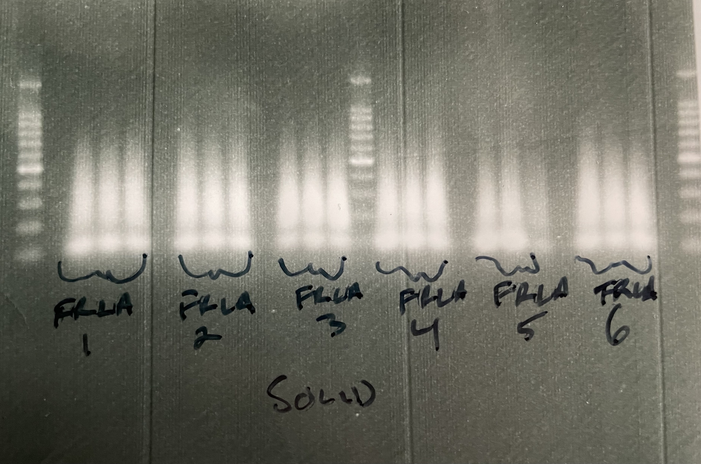
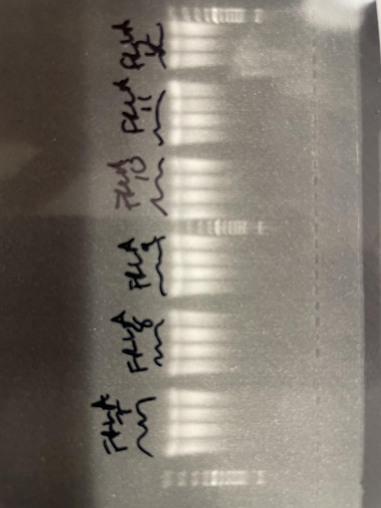

# fraxinus_latifolia
# Organization and Workflow for *Fraxinus latifolia* GBS 
Organizational notes and code for two sequencing sets:
- rangewide sampling for landscape genomic analyses
- sequencing of indivuals from provenance trials

# Range-wide landscape genomics: sample organization and GBS workflow 

## Sample organization
- Full information on DNAs for each individual sampled across natural distribution can be found in `2022_FRALAT_NaturalPopulations_RADSeq_Sequencing_PlateDesign_TParchman_sharable.xlsx`. This file also has the updated plate maps with specified IDs.

- barcode key files correspond with LIB1 (plates 1-6; `barcode_info_FRALAT_NaturalPopulations_Plate1-6.csv`) and LIB2 (plates 7-12; `barcode_info_FRALAT_NaturalPopulations_Plate7-12.csv`).

- **NOTE** I added 32 samples (4 plate columns) of *Pinus rigida* DNAs from Connie Bolte to plate 12. Thus, plate 12 now has 10 columns of DNAs, rather than 6. The *P. rigida* PCR product will be diluted 2 fold compared to *Fraxinus* for the final libraries.

## GBS workflow

- All organizational information, and notes on lab workflow are in `GBS_rangewide/` .

## Notes on library preparation

**NEED TO DO**: anneal more MSE adaptors, order iproof (have martinson order a tube), order ladder

### 12/19-12/22: R/L and PCR for plates 1-6. Master mix in `FRAXONE_RFseq_mastermixcockatils.xlsx`.

12/23/22: gel for FRLA_LIB1
 

10 ul of each PCR product into final library. Tubes in door of freezer labelled **FRLA_LIB1**.

### 12/28 - 12/31: R/L and PCR for plates 7-12. Master mix in `FRAXTWO_RFseq_mastermixcockatils.xlsx`. Note, plate 12 is 85% full, and contains 4 columns of *P. rigida* DNAs from Connie Bolte.

12/31/22: gel for FRLA_LIB2
 

10 ul of each PCR product into final library. Tubes in door of freezer labelled **FRLA_LIB2**.

## Data analysis: contaminant cleaning, barcode parsing, data storage, directory organization, and initial analyses.

We generated two lanes of S2 chemistry NovaSeq data at UTGSAF in March of 2023. FRLA1 has plates 1-6, FRLA2 has plates 7-12, plate 12 has some Pinus rigida for Connie Bolte.

## This file contains code and notes for
1) cleaning contaminants using tapioca
2) parsing barcodes
3) splitting fastqs 
4) de novo assembly
5) reference based assembly
6) calling variants
7) filtering
8) entropy for genotype probabilities.

## 1. Cleaning contaminants

Being executed on ponderosa using tapioca pipeline. Commands in two bash scripts (cleaning_bash_CADE.sh and cleaning_bash_SEGI.sh), executed as below (2/16/23). This was for two S2 NovaSeq lanes generated in late December 2022.

Decompress fastq file:

    $ gunzip FRLA1_S1_L001_R1_001.fastq.gz

    $ gunzip FRLA2_S2_L002_R1_001.fastq.gz

# DONE TO HERE ********
Number of reads **before** cleaning:

    $ nohup grep -c "^@" FRLA1_S1_L001_R1_001.fastq > FRLA1_number_of_rawreads.txt &
    ## raw reads: 2,279,817,982

    $ nohup grep -c "^@" FRLA2_S2_L002_R1_001.fastq > FRLA2_number_of_rawreads.txt &
    ## 
# DONE TO HERE ********

To run cleaning_bash* tapioca wrapper, exit conda environment, load modules, and run bash scripts.

    $ module load fqutils/0.4.1
    $ module load bowtie2/2.2.5
    
    $ bash cleaning_bash_FRLA1.sh &
    $ bash cleaning_bash_FRLA2.sh &

After .clean.fastq has been produced, rm raw data:

    $ rm -rf FRLA1_S1_L001_R1_001.fastq &
    $ rm -rf FRLA2_S2_L002_R1_001.fastq &

# DONE TO HERE ********

Raw data will stay stored in: /archive/parchman_lab/rawdata_to_backup/FRLA/

Number of reads **after** cleaning:

    $ nohup grep -c "^@" FRLA1.clean.fastq > FRLA1_clean_reads.txt &
    # FRLA1 : 1528882238

    $ nohup grep -c "^@" FRLA2.clean.fastq > FRLA2_clean_reads.txt.txt &
    # FRLA2: 

####################################################################################
## 2. Barcode parsing:
####################################################################################

Be sure to deactivate conda environment before running the below steps. Barcode keyfiles are `/working/parchman/FRLA/FRLA1_barcode_key.csv` and `/working/parchman/FRLA/FRLA2_barcode_key.csv`

Parsing FRLA1 library:

    $ nohup perl parse_barcodes768.pl FRLA1_barcode_key.csv FRLA1.clean.fastq A00 &>/dev/null &

Parsing FRLA2 library:

    $ nohup perl parse_barcodes768.pl FRLA2_barcode_key.csv FRLA2.clean.fastq A00 &>/dev/null &

`NOTE`: the A00 object is the code that identifies the sequencer (first three characters after the @ in the fastq identifier).

    $ less parsereport_FRLA1.clean.fastq
    Good mids count: 1470709510
    Bad mids count: 58172533

    $ less parsereport_FRLA2.clean.fastq
    

####################################################################################
## 3. splitting fastqs
####################################################################################

For FRLA, doing this in `/working/parchman/FRLA/splitfastqs_FRLA*`

Make ids file

    $ cut -f 3 -d "," FRLA1_barcode_key.csv | grep "_" > FRLA1_ids_noheader.txt

    $ cut -f 3 -d "," FRLA2_barcode_key.csv | grep "_" > FRLA2_ids_noheader.txt

Split fastqs by individual

    $ nohup perl splitFastq_universal_regex.pl FRLA1_ids_noheader.txt parsed_FRLA1.clean.fastq &>/dev/null &

    $ nohup perl splitFastq_universal_regex.pl FRLA2_ids_noheader.txt parsed_FRLA2.clean.fastq &>/dev/null &

# DONE TO HERE &&&&&&&&&&

Zip the parsed*fastq files for now, but delete once patterns and qc are verified.

### Moving fastqs to project specific directories

Fastqs by species are located on ponderosa in:

FRLA1:
`/working/parchman/FRLA`

FRLA2:
`/working/parchman/FRLA`

